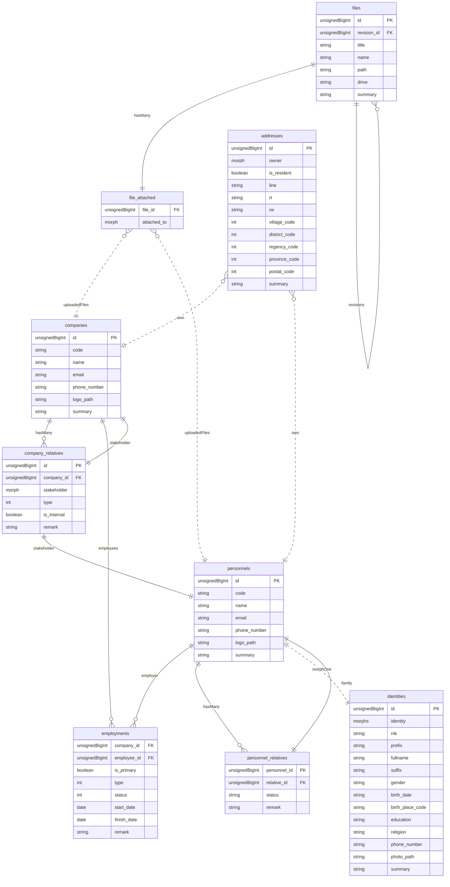
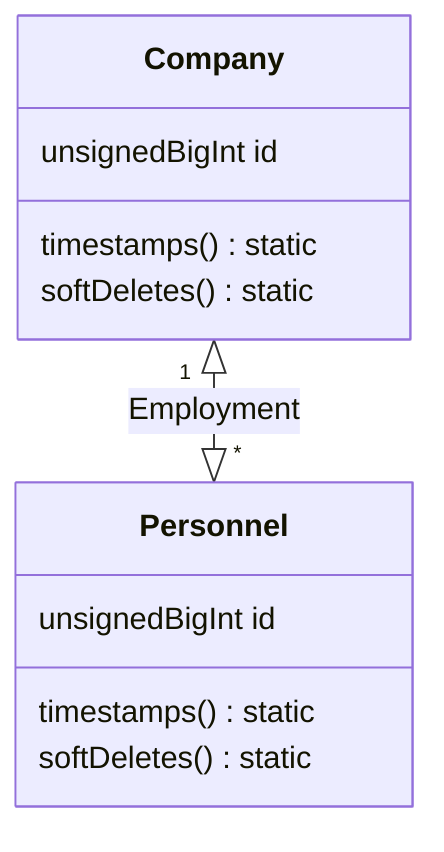
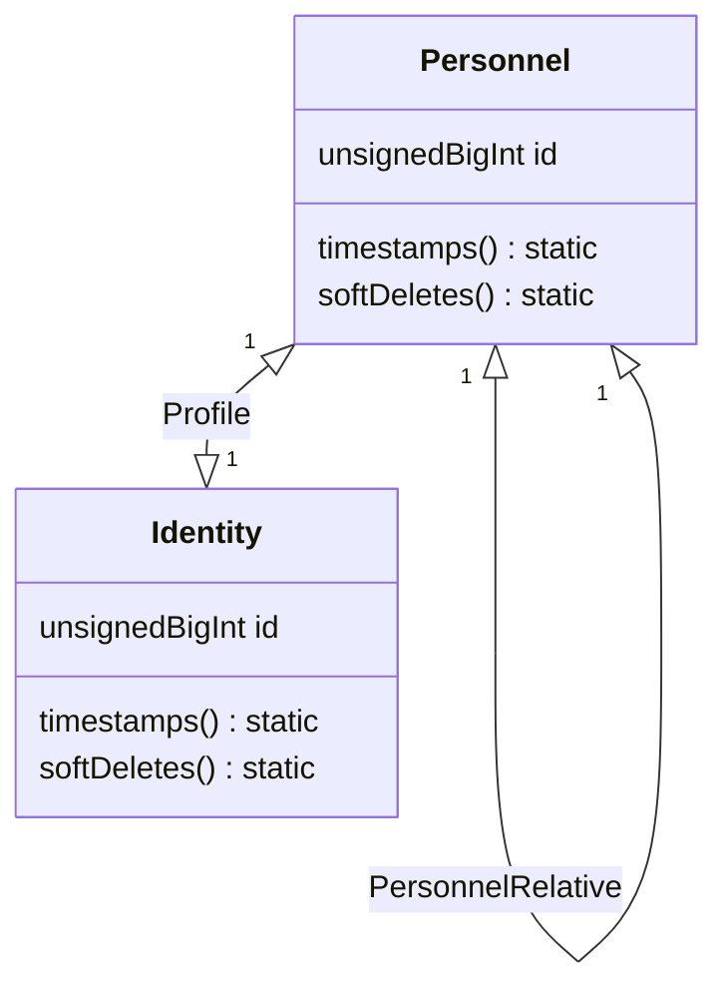
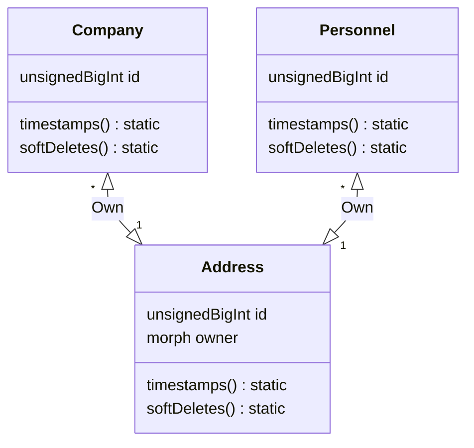
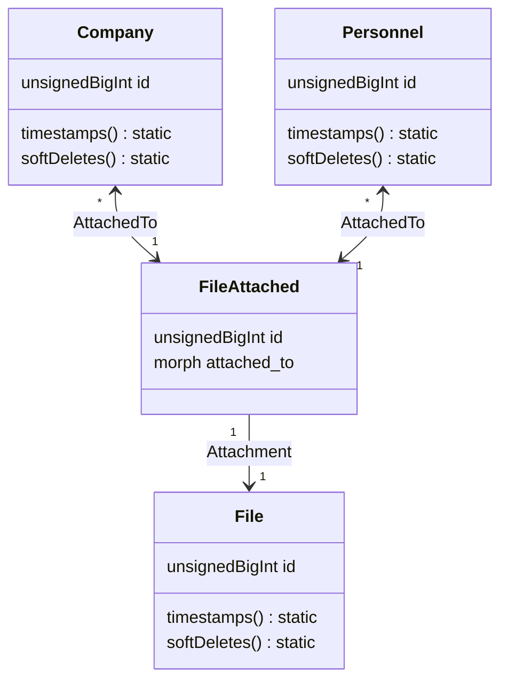

# Database Structure

---
## Companies

### `companies`

| Field | Attribute | Key | Description |
| --- | --- | :---: | --- |
| `id` | `unsignedBigInt` | `primary` | - |
| `code` | `string`, `nullable` | `unique` | - |
| `name` | `string` | | - |
| `email` | `string`, `nullable` | `unique` | - |
| `phone_number` | `varchar(20)`, `nullable` | | - |
| `logo_path` | `string`, `nullable` | | - |
| `summary` | `text`, `nullable` | | - |

**Model Attributes**
- `timestamps`
- `softDeletes`

### `company_relatives` (morphPivot)

| Field | Attribute | Key | Description |
| --- | --- | :---: | --- |
| `id` | `unsignedBigInt` | `primary` | - |
| `company_id` | `unsignedBigInt` | `foreign` | - |
| `stakeholder` | `morphs`, `nullable` | | - |
| `type` | `unsignedSmallInt`, `nullable` | | - |
| `is_internal` | `boolean`, `default: false` | | - |
| `remark` | `text`, `nullable` | | - |

**Relation Properties**
- `company_id` : reference `companies`

## Employment

### `employments` (morphPivot)

| Field | Attribute | Key | Description |
| --- | --- | :---: | --- |
| `company_id` | `unsignedBigInt` | `foreign` | - |
| `employee_id` | `unsignedBigInt` | `foreign` | - |
| `is_primary` | `boolean`, `default: false` | | - |
| `type` | `unsignedSmallInt`, `nullable` | | - |
| `status` | `unsignedSmallInt`, `nullable` | | - |
| `start_date` | `date`, `nullable` | | - |
| `finish_date` | `date`, `nullable` | | - |
| `remark` | `text`, `nullable` | | - |

**Relation Properties**
- `company_id` : reference `companies`
- `employee_id` : reference `personnels`

## Personnel and Identities

### `personnels`

| Field | Attribute | Key | Description |
| --- | --- | :---: | --- |
| `id` | `unsignedBigInt` | `primary` | - |
| `code` | `string`, `nullable` | `unique` | - |
| `name` | `string` | | - |
| `email` | `string`, `nullable` | `unique` | - |
| `phone_number` | `varchar(20)`, `nullable` | | - |
| `photo_path` | `string`, `nullable` | | - |
| `summary` | `text`, `nullable` | | - |

**Model Attributes**
- `timestamps`
- `softDeletes`

### `personnel_relatives` (morphPivot)

| Field | Attribute | Key | Description |
| --- | --- | :---: | --- |
| `personnel_id` | `unsignedBigInt` | `foreign` | - |
| `relative_id` | `unsignedBigInt` | `foreign` | - |
| `status` | `unsignedSmallInt`, `nullable` | | - |
| `remark` | `text`, `nullable` | | - |

**Relation Properties**
- `personnel_id` : reference `personnels`
- `relative_id` : reference `personnels`

### `identities`

| Field | Attribute | Key | Description |
| --- | --- | :---: | --- |
| `id` | `unsignedBigInt` | `primary` | - |
| `identity` | `morphs`, `nullable` | | - |
| `nik` | `char(16)`, `nullable` | | - |
| `prefix` | `varchar(10)`, `nullable` | | - |
| `fullname` | `string` | | - |
| `suffix` | `varchar(10)`, `nullable` | | - |
| `gender` | `char(1)` | | - |
| `birth_date` | `date`, `nullable` | | - |
| `birth_place_code` | `char(4)`, `nullable` | | - |
| `education` | `varchar(3)`, `nullable` | | - |
| `religion` | `unsignedTinyInt`, `nullable` | | - |
| `phone_number` | `varchar(20)`, `nullable` | | - |
| `photo_path` | `string`, `nullable` | | - |
| `summary` | `text`, `nullable` | | - |

**Model Attributes**
- `timestamps`
- `softDeletes`

## Addresses

### `addresses`

| Field | Attribute | Key | Description |
| --- | --- | :---: | --- |
| `id` | `unsignedBigInt` | `primary` | - |
| `owner` | `morphs`, `nullable` | | - |
| `is_resident` | `boolean` | | - |
| `line` | `string` | | - |
| `rt` | `char(3)`, `nullable` | | - |
| `rw` | `char(3)`, `nullable` | | - |
| `village_code` | `char(10)`, `nullable` | | - |
| `district_code` | `char(6)`, `nullable` | | - |
| `regency_code` | `char(4)`, `nullable` | | - |
| `province_code` | `char(2)`, `nullable` | | - |
| `postal_code` | `char(5)`, `nullable` | | - |
| `summary` | `text`, `nullable` | | - |

**Model Attributes**
- `timestamps`
- `softDeletes`

## Uploaded Files

### `files`

| Field | Attribute | Key | Description |
| --- | --- | :---: | --- |
| `id` | `uuid` | `primary` | - |
| `revision_id` | `uuid`, `nullable` | `foreign` | Indicates that this row is actually a revision of parent `id` |
| `title` | `string`, `nullable` | | - |
| `name` | `string` | | - |
| `path` | `string`, `nullable` | | - |
| `drive` | `string`, `nullable` | | - |
| `summary` | `string`, `nullable` | | - |

**Model Attributes**
- `timestamps`
- `softDeletes`

**Relation Properties**
- `revision_id` : reference `files`

### `file_attached` (pivot)

| Field | Attribute | Key | Description |
| --- | --- | :---: | --- |
| `file_id` | `uuid` | `foreign` | - |
| `attached_to` | `morphs`, `nullable` | | - |

**Relation Properties**
- `file_id` : reference `files`
