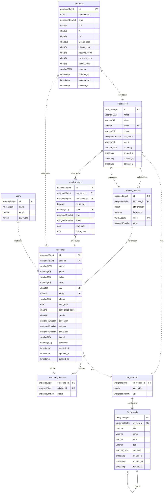
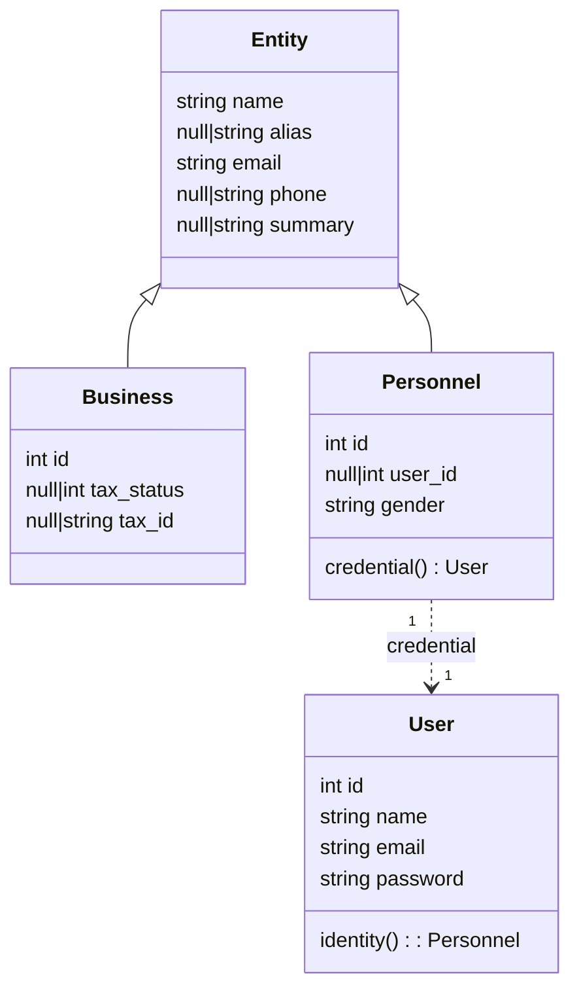
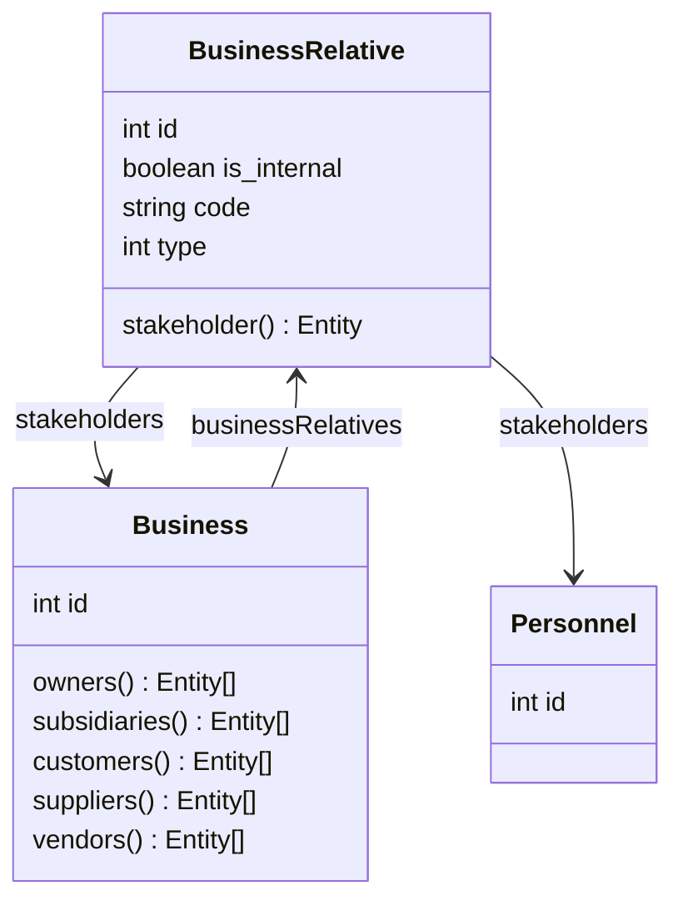
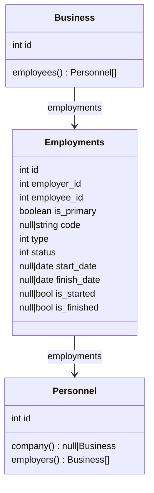
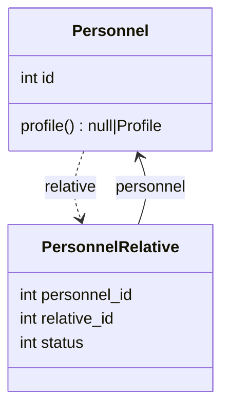
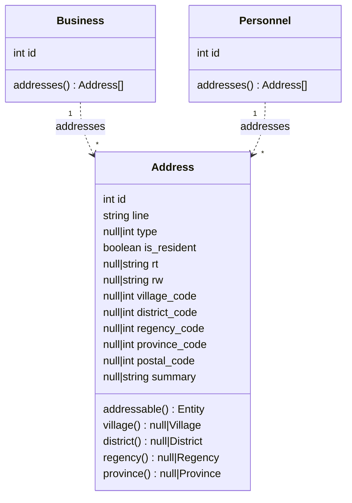
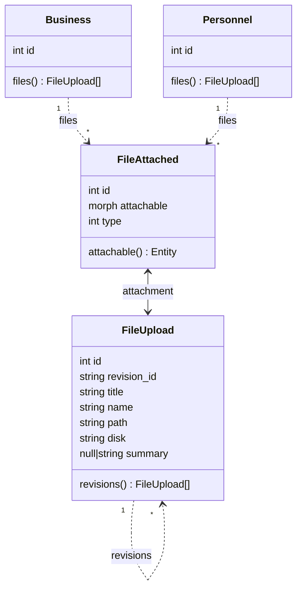

# Database Structure

---
## Entities

Either a companies or an individuals are tent to shares some similarities, which is they must have a way for externals to communicate with them. The most common ways are by `email` or `phone`. In that regard, another similarity is they must have a name, but there's case that differenciate how we describe the way we call them. A businesses are commonly use term `legal_name` and `alias_name`, while an individuals are commonly using `full_name` and `nick_name`. Either of them serve the same purposes.

Despite those similarities they must have some differences, including :
- An individual does have gender, while a company doesn't
- An individual might have a credential so they can logging in to the system, while a company shouldn't

## Businesses

A business must have some sort of [relationship](https://www.investopedia.com/terms/b/business-relations.asp) to the externals, either to another business or individuals regardless of its size. The most common term to describe it is [stakeholder](https://www.investopedia.com/terms/s/stakeholder.asp).

> A stakeholder is a person or group with an interest in an enterprise - [What Are Stakeholders: Definition, Types, and Examples](https://www.investopedia.com/terms/s/stakeholder.asp)

In this implementation we try to cover 5 most basic and common business relationship, which are :

- **Owner**

  Cover business relation between the company to a individual(s) who own the business.

- **Subsidiary**

  Cover business relation between the company to other businesses that act as a child company. The parent company can be called parent or holding company, and the child company can be called child company or operating company.

- **Customer**

  Cover business relation between the company either to individual or business who makes a business its money. 

- **Supplier**

  Cover business relation between the company either to individual or business who provide the raw materials to the business so the can produce their goods.

- **Vendor**

  Cover business relation between the company either to individual or business who provide the tangible assets to the business so they can proceed the raw materials into goods.

The term "stakeholders" itself is actually covers a lot more than that, even employees are counted as stakeholders. But at this stage we can't afford to comply those types of relationship, simply because that's beyond of our cababilities to handle them at the moment.

### `businesses`

| Field | Attribute | Key | Description |
| --- | --- | :---: | --- |
| `id` | `unsignedBigInt`, `incrementing` | `primary` | |
| `name` | `varchar(150)` | | Must contain legal name of the business, e.g : `PT. Creasi Tekno Solusi` |
| `alias` | `varchar(50)`, `nullable` | | Must contain alias name from its legal name of the business, e.g : `Creasico` |
| `email` | `varchar`, `nullable` | `unique` | The business primary email address, e.g : `hello@creasi.co` |
| `phone` | `varchar(20)`, `nullable` | | The business primary phone number |
| `tax_status` | `unsignedSmallInt`, `nullable` | | |
| `tax_id` | `varchar(16)`, `nullable` | | |
| `summary` | `varchar(200)`, `nullable` | | |

**Model Attributes**
- `timestamps`
- `softDeletes`

### `business_relatives` (morphPivot)

| Field | Attribute | Key | Description |
| --- | --- | :---: | --- |
| `id` | `unsignedBigInt`, `incrementing` | `primary` | |
| `business_id` | `unsignedBigInt` | `foreign` | |
| `stakeholder` | `morphs`, `nullable` | | |
| `is_internal` | `boolean` | | Determine whether the stakeholder is actually from internal business, default: `false` |
| `code` | `varchar(100)`, `nullable` | `unique` | |
| `type` | `unsignedSmallInt`, `nullable` | | |

**Relation Properties**
- `business_id` : reference `businesses`

## Employment

Essentially the `employments` mechanism can be done using `business_relatives`, but since it has certain entities that differs compared to the other stakeholders we should pivot it into different table. Another reason is it could be easier to manage the spesific relation when using dedicated table.

### `employments` (morphPivot)

| Field | Attribute | Key | Description |
| --- | --- | :---: | --- |
| `id` | `unsignedBigInt`, `incrementing` | `primary` | |
| `employer_id` | `unsignedBigInt` | `foreign` | ID of the company |
| `employee_id` | `unsignedBigInt` | `foreign` | ID of the personnel |
| `is_primary` | `boolean` | | Determine whether it's the personnel's primary company, default: `false` |
| `code` | `varchar(100)`, `nullable` | `unique` | An identification that given by the company to employee |
| `type` | `unsignedSmallInt`, `nullable` | | Define the employment type of the personnel in the company |
| `status` | `unsignedSmallInt`, `nullable` | | |
| `start_date` | `date`, `nullable` | | |
| `finish_date` | `date`, `nullable` | | |

**Relation Properties**
- `employer_id` : reference `businesses`
- `employee_id` : reference `personnels`

**Employment Types**
- Unemployeed
- Fulltime
- Parttime
- Internship
- Freelance

**Employment Statuses**
- Candidate
- Probation
- Contract
- Permanent

**Note :**
Field `type` and `status` shouldn't be detachable so we can maintain historical changes of the personnel in the company.

## Personnel and Profile

Every individuals should have their own identity, it also can helps a business to identify better of their individuals. But there's a circumstance that a business doesn't really care about that, all they need is just a way to communicate with the individuals, and that's it.

Meanwhile, a business might want to be able to also communicate with their personnel's relatieves. That case mostly used by a company to it employees in regards when there's an unexpected happens and the company decided to communicate it to their employee's relatives

### `personnels`

| Field | Attribute | Key | Description |
| --- | --- | :---: | --- |
| `id` | `unsignedBigInt`, `incrementing` | `primary` | |
| `user_id` | `unsignedBigInt`, `nullable` | `foreign` | |
| `name` | `varchar(150)` | | |
| `alias` | `varchar(50)`, `nullable` | | |
| `email` | `varchar`, `nullable` | `unique` | |
| `phone` | `varchar(20)`, `nullable` | | |
| `gender` | `char(1)` | | |
| `summary` | `varchar(200)`, `nullable` | | |

**Model Attributes**
- `timestamps`
- `softDeletes`

**Relation Properties**
- `user_id` : reference `users`

### `personnel_relatives` (morphPivot)

| Field | Attribute | Key | Description |
| --- | --- | :---: | --- |
| `personnel_id` | `unsignedBigInt` | `foreign` | |
| `relative_id` | `unsignedBigInt` | `foreign` | |
| `status` | `unsignedSmallInt`, `nullable` | | |

**Relation Properties**
- `personnel_id` : reference `personnels`
- `relative_id` : reference `personnels`

**Personnel Relative Statuses**
- Child
- Spouse
- Sibling
- SiblingsChild
- Parent
- ParentsSibling
- Grandparent
- Grandchild
- Cousin

### `profiles`

| Field | Attribute | Key | Description |
| --- | --- | :---: | --- |
| `id` | `unsignedBigInt`, `incrementing` | `primary` | |
| `identity` | `morphs`, `nullable` | | |
| `nik` | `char(16)`, `nullable` | | |
| `prefix` | `varchar(10)`, `nullable` | | |
| `suffix` | `varchar(10)`, `nullable` | | |
| `birth_date` | `date`, `nullable` | | |
| `birth_place_code` | `char(4)`, `nullable` | `foreign` | |
| `education` | `varchar(3)`, `nullable` | | |
| `religion` | `unsignedTinyInt`, `nullable` | | |
| `tax_status` | `unsignedSmallInt`, `nullable` | | |
| `tax_id` | `varchar(16)`, `nullable` | | |

**Model Attributes**
- `timestamps`
- `softDeletes`

**Relation Properties**
- `birth_place_code` : reference `regencies`

**Profile Educations**
- Uneducated
- SD
- SMP
- SMA
- D1
- D2
- D3
- S1
- S2
- S3

**Profile Religions**
- Other
- Islam
- Christian
- Catholic
- Hinduism
- Buddhism
- Confucianism

## Addresses

Another similarity either individual and business is they have address, even in some cases they might has multiple addresses. For instance that an individual might have multiple addresses when they're live in different location than their identity (NIK). In that case a business might want to have that information where its live also the location from its identity (NIK).

It also possible that either business or individual put their address information for different purposes, e.g shipment address and billing address. Your mileage might vary.

### `addresses`

| Field | Attribute | Key | Description |
| --- | --- | :---: | --- |
| `id` | `unsignedBigInt`, `incrementing` | `primary` | |
| `addressable` | `morphs`, `nullable` | | |
| `type` | `unsignedSmallInt`, `nullable` | | |
| `line` | `varchar` | | |
| `rt` | `char(3)`, `nullable` | | |
| `rw` | `char(3)`, `nullable` | | |
| `village_code` | `char(10)`, `nullable` | `foreign` | |
| `district_code` | `char(6)`, `nullable` | `foreign` | |
| `regency_code` | `char(4)`, `nullable` | `foreign` | |
| `province_code` | `char(2)`, `nullable` | `foreign` | |
| `postal_code` | `char(5)`, `nullable` | | |
| `summary` | `varchar(200)`, `nullable` | | |

**Model Attributes**
- `timestamps`
- `softDeletes`

**Relation Properties**
- `village_code` : reference `villages`
- `district_code` : reference `districts`
- `regency_code` : reference `regencies`
- `province_code` : reference `provinces`

**Address Types**
Currently there's only 2 types of address, which is :
- `Legal` : Meaning that the address data is what defined in their legal document,
- `Resident` : Meaning that the address data  is actually the place where their live,

But it can be extended by the config `creasi.base.address.types` value, that said we have flexibility to define the address type per-project-basis.

## Uploaded Files

Last but not least, either company or individual might also be able to have certain files or documents to runs the business. This functionality can serve any kind of purposes and its might be vary depending of the business. For instance, as simple as both might want to upload their photo e.g an profile avatar or company logo. Meanwhile there's business that want to serve their invoice, quotation or any other document.

It also possible to store an `.xlsx` or `.csv` file that would be used for data imports, so the import process can be done in the background and once the process is finished, the system can remove the stored files and keep it neat and clean as the business goes.

### `file_uploads`

| Field | Attribute | Key | Description |
| --- | --- | :---: | --- |
| `id` | `uuid` | `primary` | |
| `revision_id` | `uuid`, `nullable` | `foreign` | Indicates that this row is actually a revision of parent `id` |
| `title` | `varchar`, `nullable` | | |
| `name` | `varchar` | | |
| `path` | `varchar`, `nullable` | | |
| `disk` | `varchar`, `nullable` | | |
| `summary` | `varchar(200)`, `nullable` | | |

**Model Attributes**
- `timestamps`
- `softDeletes`

**Relation Properties**
- `revision_id` : reference `file_uploads`

### `file_attached` (morphPivot)

| Field | Attribute | Key | Description |
| --- | --- | :---: | --- |
| `file_upload_id` | `uuid` | `foreign` | |
| `attachable` | `morphs`, `nullable` | | |
| `type` | `insignedSmallInt` | | |

**Relation Properties**
- `file_upload_id` : reference `file_uploads`

**File Attached Types**
- Avatar
- Image
- Document
