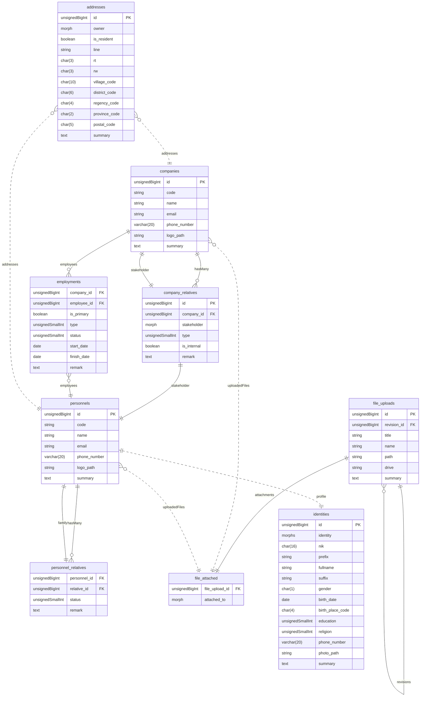
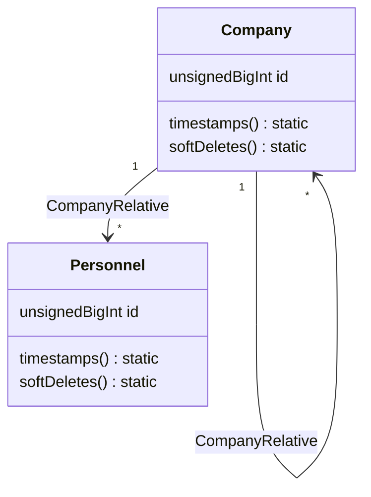
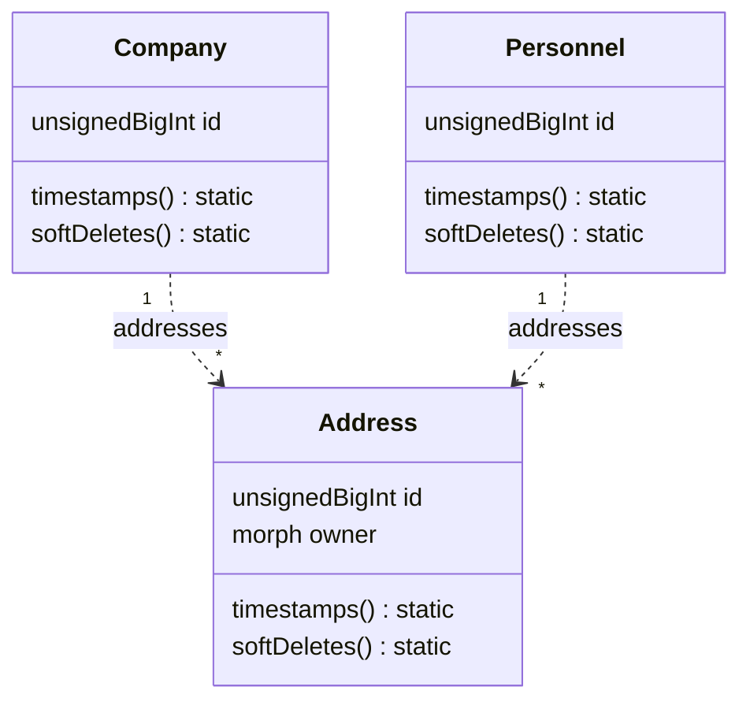
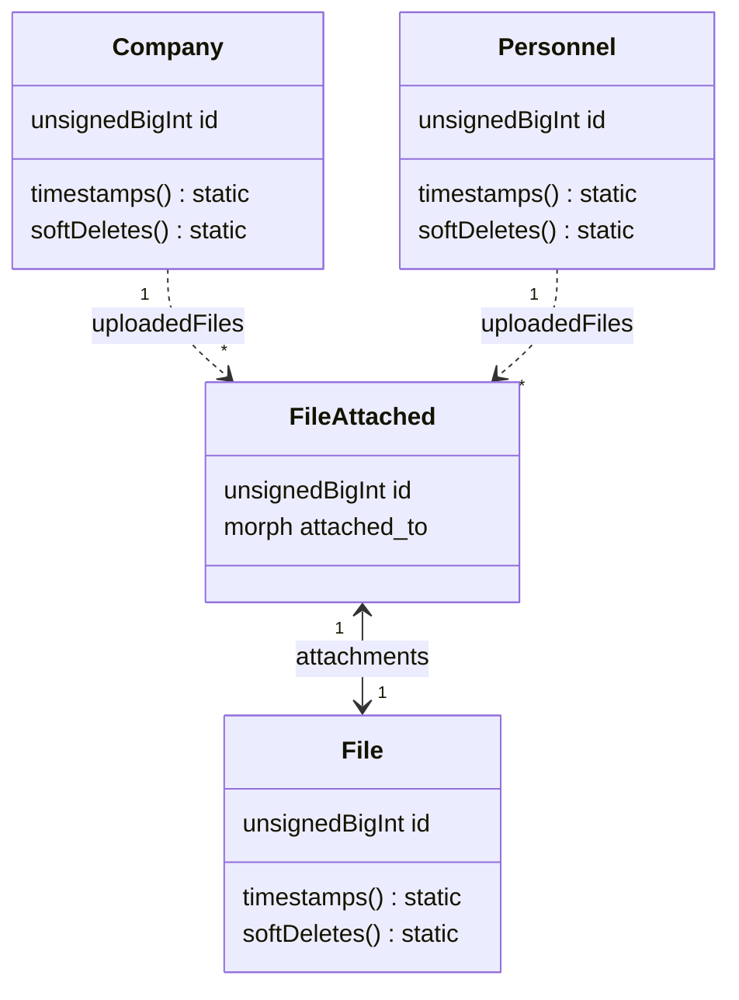

# Database Structure

---
## Companies

A Company tent to have some short of business relationship either to another companies or individuals regardless of its size, we call it `company_relatives` or the most common term is `stakeholder`. In this first implementation we try to cover 5 most basic business relationship, which are :

- **Owner**

  Cover business relation between company to individuals who own the company.

- **Subsidiary**

  Cover business relation between company to other companies that act as a child company. The parent company can be called parent or holding company, and the child company can be called child company or operating company.

- **Customer**

  Cover business relation between company to either individuals or other companies where the revenues are generated from. 

- **Supplier**

  Cover business relation between company to either individuals or other companies where the production raw materials are came from.

- **Vendor**

  Cover business relation between company to either individuals or other companies where the tangible assets are provided from.

The term `stakeholder` itself is actually covers a lot more than that, it can be `investor`, `founder`, and even `employee`. But at this stage we can't afford to comply those types of stakeholding simply because that's beyond our cababilities to handle them.

### `companies`

| Field | Attribute | Key | Description |
| --- | --- | :---: | --- |
| `id` | `unsignedBigInt`, `incrementing` | `primary` | - |
| `code` | `string`, `nullable` | `unique` | - |
| `name` | `string` | | - |
| `email` | `string`, `nullable` | `unique` | - |
| `phone_number` | `varchar(20)`, `nullable` | | - |
| `logo_path` | `string`, `nullable` | | - |
| `summary` | `text`, `nullable` | | - |

**Model Attributes**
- `timestamps`
- `softDeletes`

### `company_relatives` (morphPivot)

| Field | Attribute | Key | Description |
| --- | --- | :---: | --- |
| `id` | `unsignedBigInt`, `incrementing` | `primary` | - |
| `company_id` | `unsignedBigInt` | `foreign` | - |
| `stakeholder` | `morphs`, `nullable` | | - |
| `type` | `unsignedSmallInt`, `nullable` | | - |
| `is_internal` | `boolean`, `default: false` | | - |
| `remark` | `text`, `nullable` | | - |

**Relation Properties**
- `company_id` : reference `companies`

## Employment

Essentially the `employments` workflow's can be done using `company_relatives`, but since it has certain entities that differs compared to the other stakeholders we should pivot it into different table. Another reason is it could be easier to manage the spesific relation using dedicated table.

### `employments` (morphPivot)

| Field | Attribute | Key | Description |
| --- | --- | :---: | --- |
| `company_id` | `unsignedBigInt` | `foreign` | - |
| `employee_id` | `unsignedBigInt` | `foreign` | - |
| `is_primary` | `boolean`, `default: false` | | - |
| `type` | `unsignedSmallInt`, `nullable` | | - |
| `status` | `unsignedSmallInt`, `nullable` | | - |
| `start_date` | `date`, `nullable` | | - |
| `finish_date` | `date`, `nullable` | | - |
| `remark` | `text`, `nullable` | | - |

**Relation Properties**
- `company_id` : reference `companies`
- `employee_id` : reference `personnels`

## Personnel and Identities

Every individuals should have its own Identity, but there's some circumstance that we don't really need that kind of details for every individuals in our business.

In some instance of business it might be required to have some short of personnel relatiove defined and managed by the company. That way the company can have contact of its employees' relative so they can be contacted in case of the unexpected happens with the specific employee.

### `personnels`

| Field | Attribute | Key | Description |
| --- | --- | :---: | --- |
| `id` | `unsignedBigInt`, `incrementing` | `primary` | - |
| `code` | `string`, `nullable` | `unique` | - |
| `name` | `string` | | - |
| `email` | `string`, `nullable` | `unique` | - |
| `phone_number` | `varchar(20)`, `nullable` | | - |
| `photo_path` | `string`, `nullable` | | - |
| `summary` | `text`, `nullable` | | - |

**Model Attributes**
- `timestamps`
- `softDeletes`

### `personnel_relatives` (morphPivot)

| Field | Attribute | Key | Description |
| --- | --- | :---: | --- |
| `personnel_id` | `unsignedBigInt` | `foreign` | - |
| `relative_id` | `unsignedBigInt` | `foreign` | - |
| `status` | `unsignedSmallInt`, `nullable` | | - |
| `remark` | `text`, `nullable` | | - |

**Relation Properties**
- `personnel_id` : reference `personnels`
- `relative_id` : reference `personnels`

### `identities`

| Field | Attribute | Key | Description |
| --- | --- | :---: | --- |
| `id` | `unsignedBigInt`, `incrementing` | `primary` | - |
| `identity` | `morphs`, `nullable` | | - |
| `nik` | `char(16)`, `nullable` | | - |
| `prefix` | `varchar(10)`, `nullable` | | - |
| `fullname` | `string` | | - |
| `suffix` | `varchar(10)`, `nullable` | | - |
| `gender` | `char(1)` | | - |
| `birth_date` | `date`, `nullable` | | - |
| `birth_place_code` | `char(4)`, `nullable` | | - |
| `education` | `varchar(3)`, `nullable` | | - |
| `religion` | `unsignedTinyInt`, `nullable` | | - |
| `phone_number` | `varchar(20)`, `nullable` | | - |
| `photo_path` | `string`, `nullable` | | - |
| `summary` | `text`, `nullable` | | - |

**Model Attributes**
- `timestamps`
- `softDeletes`

## Addresses

### `addresses`

| Field | Attribute | Key | Description |
| --- | --- | :---: | --- |
| `id` | `unsignedBigInt`, `incrementing` | `primary` | - |
| `owner` | `morphs`, `nullable` | | - |
| `is_resident` | `boolean` | | - |
| `line` | `string` | | - |
| `rt` | `char(3)`, `nullable` | | - |
| `rw` | `char(3)`, `nullable` | | - |
| `village_code` | `char(10)`, `nullable` | | - |
| `district_code` | `char(6)`, `nullable` | | - |
| `regency_code` | `char(4)`, `nullable` | | - |
| `province_code` | `char(2)`, `nullable` | | - |
| `postal_code` | `char(5)`, `nullable` | | - |
| `summary` | `text`, `nullable` | | - |

**Model Attributes**
- `timestamps`
- `softDeletes`

## Uploaded Files

### `file_uploads`

| Field | Attribute | Key | Description |
| --- | --- | :---: | --- |
| `id` | `uuid` | `primary` | - |
| `revision_id` | `uuid`, `nullable` | `foreign` | Indicates that this row is actually a revision of parent `id` |
| `title` | `string`, `nullable` | | - |
| `name` | `string` | | - |
| `path` | `string`, `nullable` | | - |
| `drive` | `string`, `nullable` | | - |
| `summary` | `string`, `nullable` | | - |

**Model Attributes**
- `timestamps`
- `softDeletes`

**Relation Properties**
- `revision_id` : reference `file_uploads`

### `file_attached` (pivot)

| Field | Attribute | Key | Description |
| --- | --- | :---: | --- |
| `file_upload_id` | `uuid` | `foreign` | - |
| `attached_to` | `morphs`, `nullable` | | - |

**Relation Properties**
- `file_upload_id` : reference `file_uploads`
